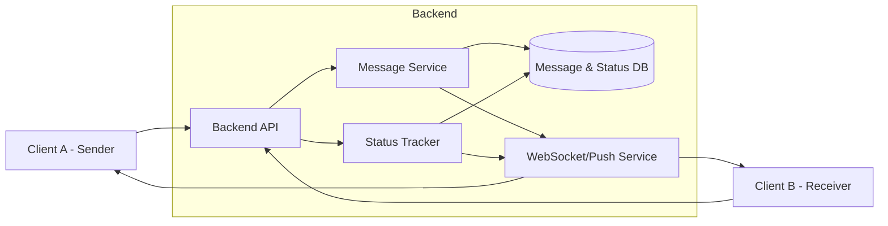
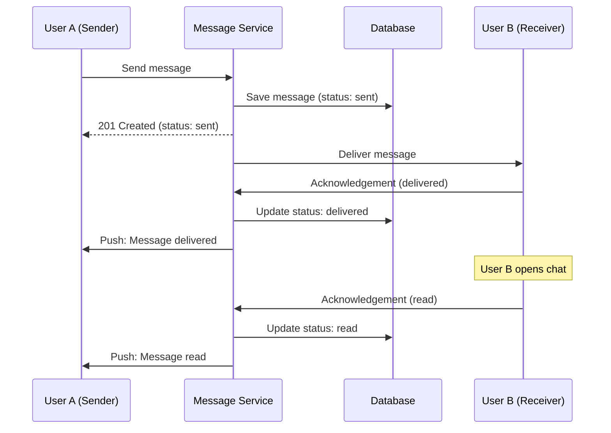
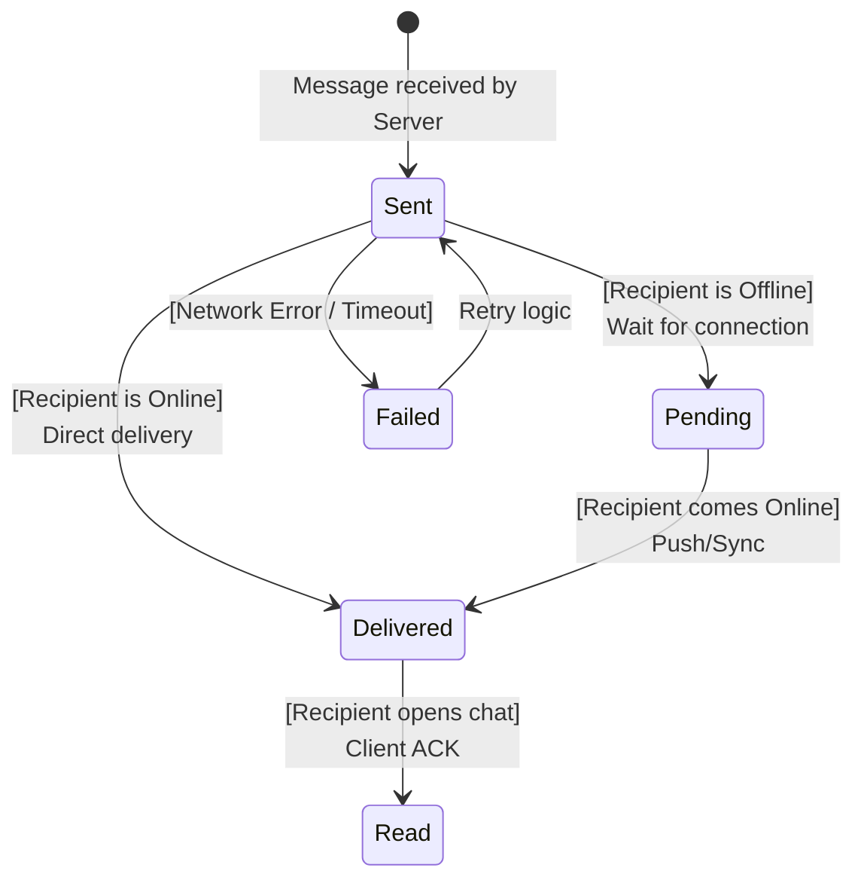

## 🔹 Variant 2 — Message Status Tracking
**Focus:** state machine and lifecycle

**Additional requirements:**
- Message statuses: `sent`, `delivered`, `read`
- Client acknowledgements

**Key questions:**
- Who updates message status?
- What happens if acknowledgements are missing?

## Component Diagram



## Sequence Diagram

### Scenario

Delivery of a message to a user with subsequent confirmation of reading



## State Diagram

### Object
`Message`



## Architecture Decision Record

```markdown
## Status
Accepted

## Context
We need to know exactly when the message was delivered to the device (Delivered) 
and when it was opened by the user (Read). The server cannot independently determine
the moment of “reading” without a signal from the client.

## Decision
Use the explicit acknowledgements mechanism from the client application via a WebSocket connection. 

- The **Delivered** status is set when the client's background process receives the packet.
- The **Read** status is set when the chat UI component becomes active on the user's screen.

## Alternatives
- **Server-side delivery only (rejected)**: The server considers the message delivered as soon as it leaves the queue (unreliable).
- **Polling (considered)**: The client periodically requests new statuses (too much load on the database).

## Consequences
+ High accuracy of statuses (real-time).
+ Ability to implement “Double Check” (check marks), as in WhatsApp/Telegram.
- Increase in the number of small entries in the database (write-heavy load).
- Need to process duplicate ACKs when the internet connection is unstable.
```
