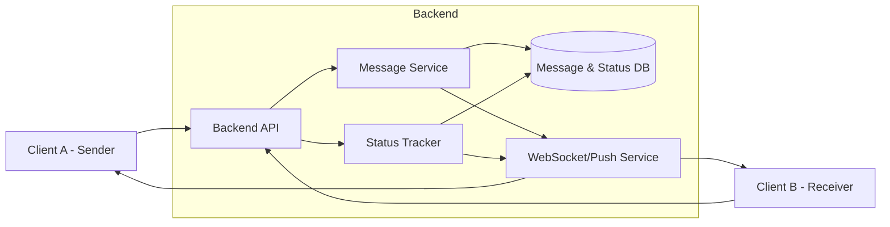

## 🔹 Variant 2 — Message Status Tracking
**Focus:** state machine and lifecycle

**Additional requirements:**
- Message statuses: `sent`, `delivered`, `read`
- Client acknowledgements

**Key questions:**
- Who updates message status?
- What happens if acknowledgements are missing?

## Component Diagram

